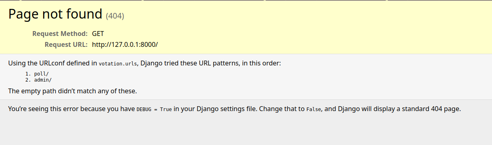
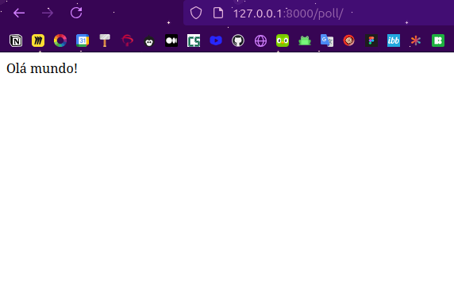
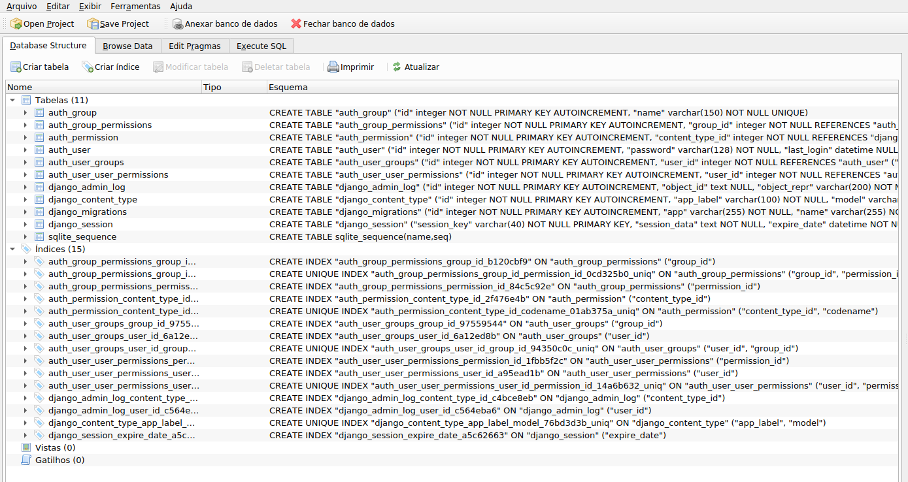
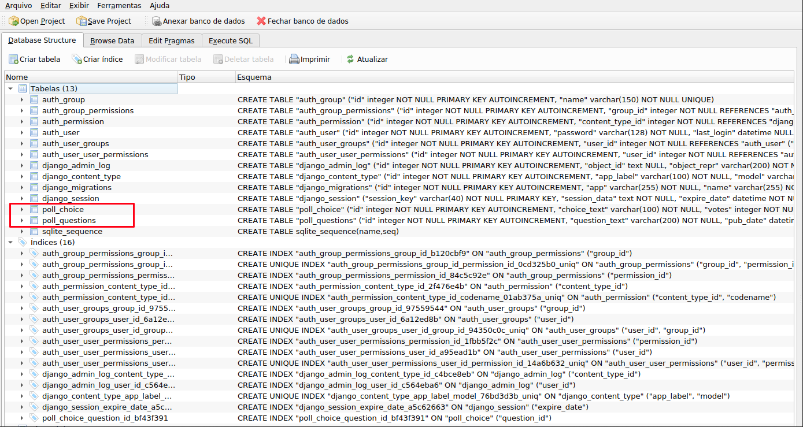
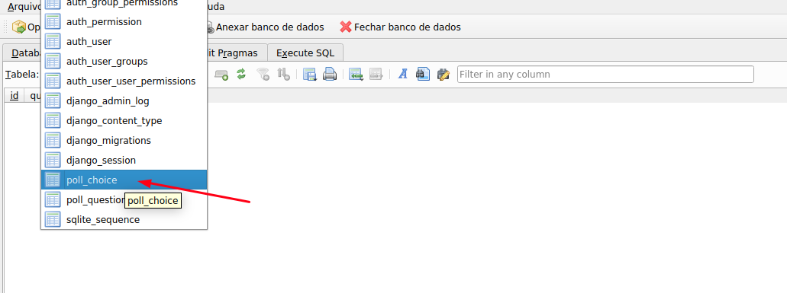
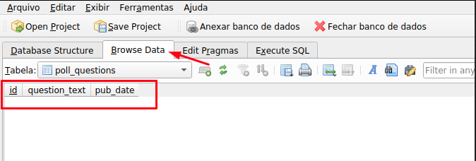
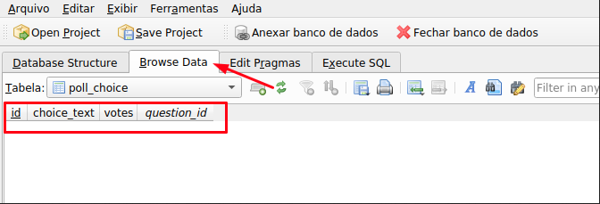
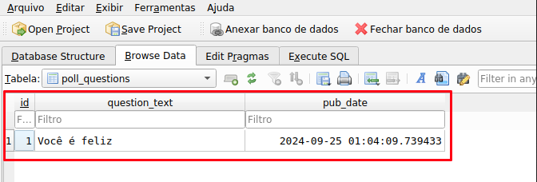

# Starting django project

Esse projeto tem a contribuição das aulas:

* [CANAL Hashtag Programação - Lira da Hastag - Explicação Estrutura básica de um projeto em Django](https://www.youtube.com/watch?v=4u0aI-90KnU)
* [CANAL Hashtag Programação - Daniel Candioto - Mini Curso](https://www.youtube.com/watch?v=kSrH89eBm_A&t=66s)
* [Link Projeto do Mini Curso](github.com)

## PRIMEIROS PASSOS

* Criar a máquina virtual do projeto
  * In: python3 -m venv .venv

* Subir a máquina virtual do projeto
  * In: source .venv/bin/activate

    _Cair a máquina virtual do projeto => In: deactivate_

* Instalar o django na máquina
  * In: pip install django

    _Checar que o danjo está instalado (erro) =>
    In: django-admin_
    Out:
        Type 'django-admin help __subcommand__' for help on a specific subcommand.

        Available subcommands:

        [django]
            check
            compilemessages
            createcachetable
            dbshell
            diffsettings
            dumpdata
            flush
            inspectdb
            loaddata
            makemessages
            makemigrations
            migrate
            optimizemigration
            runserver
            sendtestemail
            shell
            showmigrations
            sqlflush
            sqlmigrate
            sqlsequencereset
            squashmigrations
            startapp
            startproject
            test
            testserver
        Note that only Django core commands are listed as settings are not properly configured (error: Requested setting INSTALLED_APPS, but settings are not configured. You must either define the environment variable DJANGO_SETTINGS_MODULE or call settings.configure() before accessing settings.).

* Startar o projeto
  * In: django-admin startproject <nome_do_projeto>

    * Será criada uma pasta com o nome do projeto e um arquivo de nome <manage.py> => Gerencia o projeto

* Subir o projeto
  * Entrar na pasta do projeto
    * In: cd <nome_da_pasta>
    * In: python manage.py runserver
    * Out:
        Watching for file changes with StatReloader
        Performing system checks...

        System check identified no issues (0 silenced).

        You have 18 unapplied migration(s). Your project may not work properly until you apply the migrations for app(s): admin, auth, contenttypes, sessions.
        Run 'python manage.py migrate' to apply them.
        September 23, 2024 - 19:30:33 => [__PODE VARIAR__]
        Django version 5.1.1, using settings 'rent_control.settings'
        Starting development server at [http://127.0.0.1:8000/]
        Quit the server with CONTROL-C.

  * Irá criar o banco de dados, o arquivo <db.sqlite3>
  * Esse arquivo, manage.py é muito importante pois geralmente é com ele que rodamos o projeto (sobe o servidor, gerencia o banco de dados)

## PARA ENTENDER - CRIANDO O PROJETO

PASTA <nome_do_projeto>

* ARQUIVOS CRIADOS:
  * __init__.py
        => Módulo do projeto. (Ativa a navegação de pastas)

  * asgi.py
        => Tanto asgi.py quanto wsgi.py serão files python referentes a que tipo de servidor será usado para por o seu projeto no ar. Geralmente usado no fim de um projeto.

  * settings.py
        => Todas as configs do seu projeto
        Ex: Qual é a pasta do meu projeto que tem os templates que eu vou usar?
            Qual é a chave token do meu projeto pra não acessarem o meu banco de dados?
            Quais são os apps instalados no seu site?
            Qual a linguagem que você usa no seu site?
                LANGUAGE_CODE = en-us ou pt-br
            Qual o time-zone (fuso horário)?
                TIME-ZONE = UTC

  * urls.py
        => Local a definir os links do seu site
  * wsgi.py
        => Tanto asgi.py quanto wsgi.py serão files python referentes a que tipo de servidor será usado para por o seu projeto no ar. Geralmente usado no fim de um projeto.

## PARA ENTENDER - CRIANDO OS APPS

Cada app é como se fosse uma parte do projeto: login, pagamento, etc

* Cada app do meu projeto
  * In: python manage.py startapp <nome_do_app>

  * Na pasta principal, assim que criado o app, devo ir em /<nome_do_pojeto>/settings.py
    * Adicionar em 'INSTALLED_APPS' o <nome_do_app> criado.
      EX:
        INSTALLED_APPS = [
            'django.contrib.admin',
            'django.contrib.auth',
            'django.contrib.contenttypes',
            'django.contrib.sessions',
            'django.contrib.messages',
            'django.contrib.staticfiles',
            '<nome_do_app>'
        ]

Assim que criado o app, o django cria os seguintes arquivos (recursos do framework):

* /migrations => Gerencia as modificações no banco de dados
* __init__ => => Módulo do projeto. (Ativa a navegação de pastas)
* admin => O que vai aparecer na tela do dono do site, o usuário do site
* app => Configura os apps do 'APP' (no caso houses é um app e houses pode ter vários apps. o padrão é cada app ter um app só.)
* models => Gerencia as informações que serão armazenadas no banco de dados. Quais tabelas, Quais campos, etc.
    Ex:
        Casas
        Categoria
        Usuários
        Endereços
        etc.
* tests => Gerencia os testes da aplicação
* views => Lógica por trás do seu site. (Lógica por trás das telas, das vizualisações)
    É NESSE ARQUIVO QUE VOCÊ IRÁ VINCULAR O BACKEND DO SITE COM OS TEMPLATES QUE É O FRONTEND DO SITE (html/css/javascript).
    A PASTA 'TEMPLATES' PODE SER CRIADA TANTO DENTRO DE CADA APP ASSIM COMO UM ÚNICO (na mesma hierarquia do manage.py)
    Ex:
        Quando o usuário clicar no link 'houses' o que eu quero que carregue pra ele? (Define as funções, classes, etc) Se ele não estiver logado, eu quero que carregue pra ele a página de login,...

***

## NESSE PROJETO

* PASSO 1:

### Criar a primeira página do site

=> file __views.py__
    1. Criar a vizualização do site, criando a def index
    2. Atrelar essa vizualisação a uma URL, nesse caso é necessário criar um arquilo urls.py para este aplicativo

=> file __urls.py__ (do app)
    In:  
        `from django.urls import path`  
        `from . import views`           >>>views do app vigente

        `urlpatterns = [
            path('', views.index, name='index')
        ]`

=> file __urls.py__ (do projeto)
    Incluir esse path no urls do projeto
    1. Abrir /<nome_do_pojeto>/urls.py
    2. Adicionar
        EX:  
            `from django.contrib import admin`  
            `from django.urls import include, path`  

            `urlpatterns = [
                path('poll/', include('poll.urls')),
                path('admin/', admin.site.urls),
            ]`
    
    3. Podemos verificar se o mesmo deu certo, subindo o servidor. Neste caso ainda ocorrerá um erro conforme a imagem a seguir:  

    Precisamos acessar a página criada que está em /poll (conforme url criada)

* PASSO 2:

### Criando nosso banco de dados

=> file __settings.py__ (do projeto)
    1. Abrir /<nome_do_pojeto>/settings.py
    Mudamos de:
        * LANGUAGE_CODE = 'en-us'
        PARA:    LANGUAGE_CODE = 'pt-br'

        * TIME_ZONE = 'UTC'
        PARA:    TIME_ZONE = 'America/Sao_Paulo'

    2. Criar uma migração para jogar para o banco de dados
    In: python manage.py migrate

    Out:
        Operations to perform:
            Apply all migrations: admin, auth, contenttypes, sessions
        Running migrations:
        Applying contenttypes.0001_initial... OK
        Applying auth.0001_initial... OK
        Applying admin.0001_initial... OK
        Applying admin.0002_logentry_remove_auto_add... OK
        Applying admin.0003_logentry_add_action_flag_choices... OK
        Applying contenttypes.0002_remove_content_type_name... OK
        Applying auth.0002_alter_permission_name_max_length... OK
        Applying auth.0003_alter_user_email_max_length... OK
        Applying auth.0004_alter_user_username_opts... OK
        Applying auth.0005_alter_user_last_login_null... OK
        Applying auth.0006_require_contenttypes_0002... OK
        Applying auth.0007_alter_validators_add_error_messages... OK
        Applying auth.0008_alter_user_username_max_length... OK
        Applying auth.0009_alter_user_last_name_max_length... OK
        Applying auth.0010_alter_group_name_max_length... OK
        Applying auth.0011_update_proxy_permissions... OK
        Applying auth.0012_alter_user_first_name_max_length... OK
        Applying sessions.0001_initial... OK

    PODEMOS ABRIR O DB BROWSER FOR SQLITE E ENCONTRAREMOS O BANCO INICIALIZADO, com as tabelas criadas e tudo mais:

=> file __models.py.py__ (do app)

    3. Criar o modelo em models.py que vai definir como os nossos dados serão tratados e esse modelo irá gerar informações para o banco de dados: 

        Ex:  
        `from django.db import models`  

        `class Questions(models.Model):
            question_text = models.CharField(max_length=200)
            pub_date = models.DateTimeField('date published')

        class Choice(models.Model):
            question = models.ForeignKey(Questions, on_delete=models.CASCADE)
            choice_text = models.CharField(max_length=100)
            votes = models.IntegerField(default=0)
    
    4. Em seguida, da mesma maneira que fizemos a migração para todo o sistema, agora iremos fazer para as mudanças adicionadas nesse models.

        => file __apps.py__ (do app)
        Em apps.py conseguimos ver que o django criou o seguinte condigo:

            `from django.apps import AppConfig`  

            `class PollConfig(AppConfig):
                default_auto_field = 'django.db.models.BigAutoField'
                name = 'poll'`
    
    5. Iremos pegar as infos de apps.py e jogar para os apps instalados do projeto.
        => file __settings.py__ (do projeto) 
        Ex:
            INSTALLED_APPS = [
                'django.contrib.admin',
                'django.contrib.auth',
                'django.contrib.contenttypes',
                'django.contrib.sessions',
                'django.contrib.messages',
                'django.contrib.staticfiles',
            ]
        
        Iremos adicionar:
        In: 'poll.apps.PollConfig'

        Out:
            INSTALLED_APPS = [
                'poll.apps.PollConfig',
                'django.contrib.admin',
                'django.contrib.auth',
                'django.contrib.contenttypes',
                'django.contrib.sessions',
                'django.contrib.messages',
                'django.contrib.staticfiles',
            ]

    6. Usamos o comando para executar a migração, a criar essa migração. Sempre serão duas etapas:
        In: `python manage.py makemigrations`
        Out:
            poll\migrations\0001_initial.py
              - Create model Questions
              - Create model Choice
        
        In: `python manage.py migrate`
        Out:
            Operations to perform:
            Apply all migrations: admin, auth, contenttypes, poll, sessions
            Running migrations:
            Applying poll.0001_initial... OK
        
        Em nosso db podemos verificar:

### CRIANDO NOSSAS PERGUNTAS

1. Entre no ambiente Shell
    In: `python manage.py shell`

    Out:
        Python 3.12.3 (main, Sep 11 2024, 14:17:37) [GCC 13.2.0] on linux
        Type "help", "copyright", "credits" or "license" for more information.
        (InteractiveConsole)
        >>> Abre um console interativo

    Irá interferir diretamente no banco:

    In: from poll.models import Questions, Choice
    In: Questions.objects.all()
    Out: <QuerySet []>  >>> Me trás todos os objetos que foram instanciados nessa classe Questions

    In: from django.utils import timezone
    In: q = Questions(question_text='Você é feliz?', pub_date=timezone.now())

    In: print(q)
    Out: Você é feliz?

    In: q.save()
    In: q.id
    Out: 1

    In: q.question_text
    Out: 'Você é feliz?'
    In: Questions.objects.all()
    Out: <QuerySet [<Questions: Question Object (1)>]>

2. Para não aparecer o <Queryset [<Questions: Object (1)>]> como está criamos uma função na models, para que a apresentação sejá descrita em string e não como object:

    class Questions(models.Model):
        question_text = models.CharField(max_length=200)
        pub_date = models.DateTimeField('date published')

        PARA: `def __str__(self):`
                    `return self.question_text`

    class Choice(models.Model):
        question = models.ForeignKey(Questions, on_delete=models.CASCADE)
        choice_text = models.CharField(max_length=100)
        votes = models.IntegerField(default=0)

        PARA: `def __str__(self):`
                    `return self.choice_text`

    Voltando para o shell e executando a linha de código outra vez, o resultado será:

    In: Questions.objects.all()
    Out: <QuerySet [<Questions: Você é feliz?>]>

    Vide imagem:
    

3. Para pegar as perguntas mais recentes:
    Adiciono a linha referente ao tempo:

        from django.db import models
        from django.utils import timezone
        from datetime import datetime

        class Questions(models.Model):
            question_text = models.CharField(max_length=200)
            pub_date = models.DateTimeField('date published')
            
            def __str__(self):
                return self.question_text

            PARA: `def was_published_recently(self):`
                        `return self.pub_date >= timezone.now() - datetime.timedelta(days=1)`

        class Choice(models.Model):
            question = models.ForeignKey(Questions, on_delete=models.CASCADE)
            choice_text = models.CharField(max_length=100)
            votes = models.IntegerField(default=0)
            
            def __str__(self):
                return self.choice_text

4. Para adionar as alternativas:
    WIP: Video 5 - 10:34
